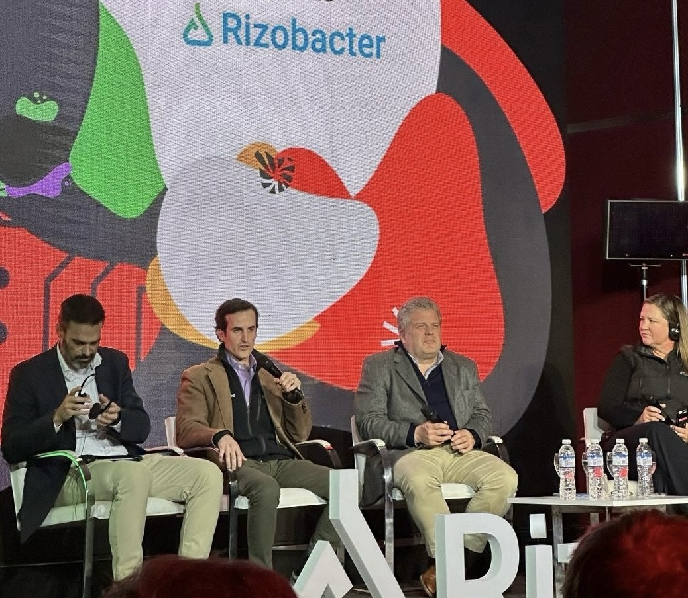

# Turn your data and AI into your competitive advantage

I have 15+ years working with GIS & Remote Sensing systems, and 5+ years implementing AI & data solutions

- Are you struggling to keep up with the rapid pace of AI innovation?

- Do you need help translating AI hype into real business results?

- Need someone who understands both technical and business perspectives?

- Do you have lots of data but aren't getting value from it?

[Book Free Intro Call :material-arrow-top-right:](https://calendly.com/joaquin-urruti/consultation-30min){ .md-button .md-button--primary }

{ .profile-image alt="Portrait of Joaquín Urruti, AI & GIS Engineer Advisor" }

## About me

Hi! I'm Joaquín!

I'm a geospatial data, [GIS](#GIS "Geospatial Information Systems") and [AI](#AI "Artificial Intelligence") consultant from Argentina. I work with agricultural companies, start-ups and technical organizations facing the challenge of translating data capabilities and AI innovation into operational efficiency and competitive advantage.

I recently led the Innovation and Development department at Espartina S.A., an Argentinian agricultural production company with more than 2,000 lots and 150,000 hectares of land, driving its transformation toward a maximum efficiency model, leveraging technology, data, and artificial intelligence to create meaningful impact on decisions, processes, and people. We automated the analysis of new fields for leasing, scaled precision management zones from 50,000 to 150,000 hectares, achieved processing of 100% of yield monitor data, automated 100% of field trial processing, and implemented AI-driven automation to interpret the statistical analysis results of those trials.

**

{ .about-profile alt="Portrait of Joaquín Urruti, AI & GIS Engineer Advisor" }

</di**v>

Before that, I led the GIS division at Espartina, developing tools and automating workflows for managing and analyzing spatial and productive data. Prior to that, I worked as a commercial analyst for major accounts at S4 Agtech, a Buenos Aires–based company specializing in parametric drought insurance for agriculture. In that position, I combined commercial and analytical responsibilities, helping clients understand their portfolio risk through satellite data and vegetation indices, and explaining how parametric insurance coverage could minimize those risks. We worked directly with re-insurers like Munich Re across Argentina, Uruguay, and Brazil, translating complex geospatial analytics into actionable risk management strategies.

With a solid background in GIS, Python programming, Google Earth Engine, and Postgres/PostGIS database development, I design and implement innovation strategies that integrate geospatial data science, remote sensing, process automation, and AI-driven optimization. My focus is always on efficiency, scalability, and ensuring that solutions are truly adopted by the teams that use them.

I'm an Agronomic Engineer from Buenos Aires University with a Master's in Open Source GIS and postgraduate studies in Agribusiness, Data Science, and Blockchain.

Beyond agriculture and technology, I have explored the applications of blockchain and cryptocurrencies in fintech and ag-tech, and I maintain a strong creative side through music. I studied jazz trumpet for several years and performed as a soloist in different professional big bands and small jazz combos. I have also played the piano since the age of six, focusing on classical, romantic, and impressionist repertoire — an artistic journey that has deeply shaped my discipline, sensitivity, and creativity.

## Why work with me?

Here's what sets me apart and how I can help drive value for your business:

-   :fontawesome-solid-building-user:{ .lg .middle } Proven Business Experience

    ---

    I come from a farming family and have an agronomy background and a career built around agricultural operations, I translate business needs into clear, actionable solutions, making the bridge between “what the farm needs” and “what we build” fast, natural, and frictionless.

-   :material-youtube:{ .lg .middle } Educator & Communicator

    ---

    My experience as a content creator and educator means I can break down complex technical concepts into clear, actionable insights. You'll always understand the 'why' behind technical decisions and get clear progress updates.

-   :material-school:{ .lg .middle } Industry Expert

    ---

    With 15+ years in geospatial data and remote sensing, I help teams convert complex spatial and agronomic realities into reliable, actionable systems—grounded in hands-on experience across agriculture, insurance, research NGOs, land valuation/division, and large-scale operations.

-   :material-rocket:{ .lg .middle } Fast Implementation

    ---

    I specialize in rapid development and deployment of AI solutions. Using modern tools and proven frameworks, I can help you move from concept to production faster, giving you a competitive edge in today's fast-paced market.

## What my past clients say about my work

-   :material-format-quote-open:{ .lg .middle } Gabriel Vázquez Amábile
    
    Agronomic Engineer (UBA), Ph.D. and Master of Science (Purdue University), Farm Administrator and Producer, Environmental Consultant at IPCC, PUMA, F.T di Tella, World Bank, FAO, AACREA and INTA.

    ---

    "I am pleased to recommend Joaquín Urruti as a highly skilled professional. As an Agricultural Engineer, he consistently leads in the adoption of advanced tools, technologies, and analytical approaches to address spatial and temporal variability in agricultural systems, delivering valuable, data-driven insights for decision-makers.
    
    Beyond his technical expertise, Joaquín is a reliable and committed professional who works exceptionally well in teams. His proactive approach, sense of responsibility, and ability to generate synergy make him a valuable contributor to any collaborative environment.

    I strongly recommend Joaquín to any organization or project seeking high-level expertise in geospatial analysis applied to agricultural production and land-use evaluation."

-   :material-format-quote-open:{ .lg .middle } Felipe Harrison
    
    Co-Founder at AgAnalyst Ltd.

    ---

    "I’ve had the pleasure of working with Joaquín over the past two years, and I would especially highlight his high level of professionalism and rigorous approach to delivering technological solutions for operations. He is always attentive to new technologies and how to apply them to real-world use cases.

    Joaquín stands out for his ability to design and implement robust, scalable systems aligned with business needs. He is a reliable and collaborative person, which makes working with him consistently a very positive experience. I recommend him without hesitation."

-   :material-format-quote-open:{ .lg .middle } Galbusera Sebastian
    
    Co-Founder and Chief Product Officer at Plataforma PUMA

    ---

    "Joaquín demonstrates excellent aptitude for developing innovative solutions, is proactive in information research and processing, designs effective technical communication tools, and works exceptionally well in collaborative environments."

-   :material-format-quote-open:{ .lg .middle } Francisco Lomazzi
    
    Sustentability Manager at Espartina S.A.

    ---

    "Joaquín is someone who is constantly looking to improve the things he does—he doesn’t settle for them simply working. I especially want to highlight his creativity, effort, and dedication, which drive him to pursue excellence continuously. 
    
    We’ve worked together on several sustainability-related projects, but I’d like to single out one in particular: he created an automation to assess farms’ legal compliance regarding agrochemical application distance requirements. It was a lot of work, but he delivered it successfully. 
    
    A real pleasure to work with Joaquín!"

-   :material-format-quote-open:{ .lg .middle } Javier Moreira de Souza
    
    Specialist in Digital Agriculture | Agricultural Consultant.

    ---

    "An intellectually sharp person, a lot of adrenaline when working together, very professional and pleasant, it was a pleasure to have worked together."

## Frequently asked questions

??? note "How quickly can you start working on my project?"
    I can typically begin new projects within 1-2 weeks of contract signing. For urgent matters, I maintain some flexibility for rapid response situations and can potentially start sooner - just let me know your timeline during our initial consultation.

??? note "Do you require a minimum project size or commitment?"
    While I can accommodate projects of any size, I find that engagements of at least 20 hours allow for meaningful impact. This gives us enough time to understand your data, implement solutions, and deliver actionable results. We can start with a small pilot project to ensure we're a good fit.

??? note "What industries do you have experience in?"
    I've successfully delivered projects across agriculture operations, administrations, farm valuations and parametric insurance services. While I specialize in AI, geospatial and remote sensing, I also apply my AI and python knowledge in projects involving all company areas.

??? note "How do you handle data security and confidentiality?"
    I take data security extremely seriously. I sign comprehensive NDAs before starting any project, use enterprise-grade encryption for all data transfers, and follow industry best practices for data handling. I can also work within your existing security infrastructure and policies.

??? note "What's your pricing structure?"
    I offer both project-based and retainer pricing models. Project fees are based on scope, complexity, and value delivered rather than hours worked. For ongoing support, I offer flexible retainer packages, and I can also provide ongoing support on an hourly basis when that’s a better fit for your needs. Let’s discuss your specific requirements during our consultation to determine the most cost-effective approach.

??? note "How do you communicate progress and results?"
    I maintain clear communication through weekly progress updates and regular check-in meetings. You'll receive detailed documentation of all analyses, findings, and recommendations.

-   :material-coffee:{ .lg .middle } Let's have a virtual coffee together!

    ---
    
    Want to see if we're a match? Let's have a chat and find out. Schedule a free 30-minute strategy session to discuss your challenges and explore how we can work together.

    [Book Free Intro Call :material-arrow-top-right:](https://calendly.com/joaquin-urruti/consultation-30min){ .md-button .md-button--primary }

