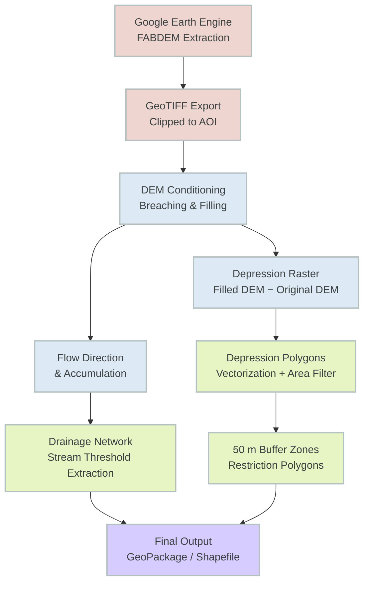

!!! abstract "Case Study Summary"
    **Industry**: Agricultural Technology / Precision Agriculture

    **Impact Metrics**:

    - 130,000+ hectares analyzed across multiple producers in a single processing run
    - 100% automated identification of concave drainage areas — zero manual digitizing required
    - 50-meter buffer zones automatically generated around every identified restriction zone
    - Reusable pipeline applicable to frost-risk and silo-bag placement assessments simultaneously

---

## Overview

This project delivers an automated geospatial pipeline to identify topographic depressions — areas where water accumulates under continuous precipitation — and map the drainage pathways connecting them across agricultural fields. The outputs directly support precision farm management decisions, specifically determining safe placement zones for silo bags and flagging areas with elevated frost risk.

---

## The Challenge

Improper silo bag placement in Argentinian agricultural fields is a persistent operational risk. Concave areas that lack natural drainage can accumulate water after heavy rainfall events, leading to grain moisture damage and significant economic losses. Identifying these zones traditionally required either agronomist field surveys — costly and time-consuming at scale — or manual interpretation of elevation data with no standardized methodology.

Beyond silo bag placement, the same topographic patterns that create waterlogging risk are also correlated with cold air pooling and elevated frost risk, a secondary use case that existing farm management tools rarely address in an automated, field-scale workflow.

Key constraints the solution had to address:

- **Scale**: The analysis needed to be reproducible across multiple fields without manual rework per parcel.
- **Data quality**: Standard elevation models (SRTM, ASTER) contain significant vegetation and building noise in agricultural landscapes; a bare-earth model was required.
- **Practicality of output**: Results needed to include a conservative buffer zone to translate raw topographic analysis into actionable restriction polygons.

---

## Technical Approach

### Technology Stack

- **Elevation Data**: [FABDEM](https://gee-community-catalog.org/projects/fabdem/) (Forest And Buildings removed Copernicus DEM) — a bare-earth global DEM at ~30m resolution, free of vegetation and building artifacts
- **Data Extraction**: Google Earth Engine Python API (`earthengine-api`)
- **Hydrological Processing**: WhiteboxTools Python frontend (`whitebox`)
- **Geospatial I/O & Manipulation**: GeoPandas, Fiona, Rasterio, Shapely
- **Buffer & Vector Operations**: GeoPandas with projected CRS
- **Environment**: Python 3.11+, reproducible via `requirements.txt`

### Why FABDEM?

Most freely available DEMs (SRTM, Copernicus DEM) retain surface elevation artifacts from tree canopy and rooftops. In agricultural areas, this introduces false depressions and distorts flow accumulation models. FABDEM applies machine-learning-based canopy and building removal on top of Copernicus DEM GLO-30, producing a significantly cleaner bare-earth surface — critical for accurate hydrological analysis at field scale.

!!! info "System Architecture"
    The pipeline follows a linear ETL structure: cloud extraction → local hydrological processing → vector output with buffer zones.

    **Components**:

    - **GEE Extraction Module**: Fetches and clips FABDEM tiles for the area of interest, exports as GeoTIFF to Google Drive
    - **WhiteboxTools Processing Module**: Performs DEM conditioning, depression filling/breach analysis, flow direction, flow accumulation, and stream network extraction
    - **Depression Mapping Module**: Derives filled-DEM difference raster to isolate concave areas; vectorizes and filters by minimum area threshold
    - **Drainage Path Module**: Extracts flow accumulation network above a configurable threshold; converts to polyline vector
    - **Buffer & Restriction Zone Module**: Applies 50 m planar buffer to depression polygons; merges overlapping zones; outputs final restriction layer

### Processing Diagram

---

## Implementation Highlights

### 1. FABDEM Extraction via GEE Python API

The area of interest is passed as a GeoJSON geometry. The script clips the FABDEM image collection, reprojects to a metric CRS, and exports the result as a Cloud Optimized GeoTIFF.

*Hydrological digital elevation model (DEM) for the study area.*

### 2. Depression Identification with WhiteboxTools

Depressions are extracted by computing the difference between the hydrologically filled DEM and the original. Cells with a positive difference indicate topographic sinks — areas where water would accumulate.

### 3. Drainage Network Extraction

Flow direction and accumulation are computed using the D8 algorithm. A configurable upstream-area threshold determines the minimum catchment size required for a cell to be classified as a stream channel.

*Corresponding satellite imagery for visual reference alongside the terrain model.*

### 4. Buffer Zone Generation

A 50 m planar buffer is applied to each depression polygon to define the practical exclusion zone for silo bag placement. Overlapping buffers are dissolved to avoid redundant polygons.

---

## Results & Impact

| Metric | Value |
|---|---|
| Hectares analyzed | 130,000+ ha across multiple producers |
| DEM resolution used | 30 m (FABDEM bare-earth) |
| Prior automated equivalent | None — analysis was not performed at this scale before |

- **Elimination of manual error**: The hydrological approach is fully deterministic — every depression above the minimum area threshold is captured, with no analyst subjectivity.
- **Reusability**: The same pipeline can be re-run for any new field geometry without code changes — only the AOI input changes.
- **Dual-use output**: The depression layer is directly reusable for frost-risk assessment, providing additional agronomic value beyond the original silo bag placement use case.
- **Conservative risk management**: The 50 m buffer adds a safety margin beyond the depression edge, accounting for DEM resolution limitations and equipment maneuvering space.

---

## My Contributions

- **End-to-end pipeline design and implementation** in Python, from GEE data extraction to final vector outputs
- **Elevation data selection**: Evaluated multiple global DEM products and selected FABDEM specifically for its bare-earth correction, which is critical for agricultural hydrological analysis
- **WhiteboxTools integration**: Configured and chained the full hydrological workflow — breach analysis, flow direction, flow accumulation, stream extraction, and depression vectorization
- **Buffer parameterization**: Defined the 50 m exclusion buffer as a conservative operational threshold, with the parameter exposed for client customization
- **Secondary use-case identification**: Recognized and documented the frost-risk application of the depression layer as an added deliverable at no additional processing cost
- **Output format decisions**: Delivered results in GeoPackage for compatibility with QGIS, ArcGIS, and common farm management platforms

---

-   :material-sprout:{ .lg .middle } Need to map drainage risk on your fields?

    ---

    Do you need to identify waterlogging or frost-risk zones at field scale before the next planting season? Book a free 30-minute session to discuss your specific terrain and data constraints.

    [Book a free call :material-arrow-top-right:](https://calendly.com){ .md-button .md-button--primary }

