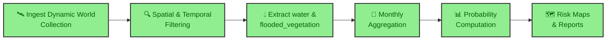

!!! abstract "Case Study Summary"
    **Client**: Agricultural Production Company — Argentina
    **Industry**: Agricultural Technology / Precision Agriculture  
    
    **Impact Metrics**:
    
    - 6+ years of Sentinel-2 historical imagery analyzed per field evaluation
    - 2 distinct flood classes identified (open water and flooded vegetation) using Google Dynamic World
    - 12-month seasonal risk profile generated per field, enabling month-by-month operational planning
    - 40-60% estimated reduction in due diligence time for land acquisition decisions
    - Quantified flood risk across 5 severity levels (0-10%, 10-20%, 20-30%, 30-40%, >40% probability)

## Overview

When acquiring or leasing farmland, understanding its water dynamics is a critical factor for decision-making. This project delivered a satellite-based analytical workflow built on the Google Earth Engine Python API that characterizes the historical behavior of water within a field, producing a probabilistic and seasonal risk profile that directly supports land acquisition and leasing negotiations.

## The Challenge

In agricultural production, a field's value is not determined solely by its productive potential. The probability of waterlogging — and the resulting loss of *trafficability* (the soil condition required for machinery to operate safely) — can compromise planting and harvesting windows, increase operational costs, and directly impact profitability.

Traditional approaches to evaluating water risk relied on single-date satellite images or sporadic field observations. These methods offered an isolated snapshot rather than a comprehensive view of how water behaves across seasons and years. Decision-makers needed a tool that could answer key questions:

- What percentage of a field's surface is historically affected by water, and during which months?
- How does flood risk vary across different parcels within the same property?
- What is the likelihood that a field will be impassable during critical campaign periods (planting and harvest)?

Without this information, buyers and tenants were exposed to hidden hydrological risks that could significantly erode expected returns.

## Technical Approach

### Technology Stack

- **Processing Platform**: Google Earth Engine — Python API (`earthengine-api`)
- **Satellite Source**: Sentinel-2 (via Google Dynamic World collection)
- **Land Cover Classification**: Google Dynamic World — near-real-time land use/land cover dataset providing per-pixel class probabilities, including distinct `water` and `flooded_vegetation` classes
- **Visualization & Reporting**: Python, Matplotlib, custom charting
- **Geospatial Data Formats**: GeoJSON for field boundaries, raster composites for water probability maps

!!! info "Methodology Note"
    While this case study was implemented using Dynamic World dataset, built from the processing of  **Sentinel-2** imagery, the methodology is designed to be sensor-agnostic. It can be extended to **Landsat 7/8** (using MNDWI thresholding) or to a **hybrid Sentinel + Landsat collection** to increase temporal depth and observation density when longer historical records are required.

### Dynamic World: Dual-Class Flood Detection

The analysis leverages **Google Dynamic World**, a near-real-time land use/land cover dataset derived from Sentinel-2 imagery. Unlike traditional water indices that produce a single binary water/non-water classification, Dynamic World provides per-pixel probability estimates for multiple land cover classes — critically including two distinct flood-related classes:

- **`water`**: Open water bodies, standing water on bare soil, and surface runoff
- **`flooded_vegetation`**: Vegetation partially or fully submerged, indicating saturated soils and waterlogged conditions without visible open water

This dual-class distinction is essential for agricultural risk assessment. A field may show no open water but still present extensive flooded vegetation — a condition that compromises soil trafficability just as severely. By tracking both classes independently, the analysis captures the full spectrum of hydrological risk.

### Extensibility to Other Sensors

While this implementation used Sentinel-2 through Dynamic World, the methodology is designed to support alternative or combined data sources. The image below illustrates how different satellite sensors and classification methods detect water across the same field:

*Comparison of water detection approaches: Sentinel-2 SCL band (left), Landsat 8 MNDWI (center), and Landsat 7 MNDWI (right). Yellow outlines indicate detected water bodies and waterlogged areas. Each method offers different tradeoffs in spatial resolution, temporal depth, and classification accuracy — the workflow can incorporate any of them depending on project requirements.*

## Implementation Highlights

### Historical Water Probability Mapping

The core algorithm processes every available Dynamic World image in the time series, extracts the `water` and `flooded_vegetation` probability bands for each pixel, and computes the historical average probability of each class at every location. The result is a pair of continuous probability surfaces that reveal which areas within a field are chronically affected by open water, flooded vegetation, or both.

*Historical water probability map for a property along the Uruguay River. Green areas indicate zones dominated by flooded vegetation; purple areas indicate persistent open water. The overlay reveals the spatial distribution of hydrological risk across seven parcels (Lote 1–7).*

### Monthly Seasonal Profiling

Beyond the historical average, the workflow generates a month-by-month breakdown of water and flooded vegetation probability. This seasonal profile is critical for agricultural planning, as it reveals whether flood risk peaks coincide with planting or harvest windows.

*Historical monthly probability of water (red) and flooded vegetation (blue) across the full satellite archive. Peaks correspond to major flood events, with recurring seasonal patterns visible year over year.*

*Averaged monthly probability profile showing the seasonal behavior of water and flooded vegetation. This view enables quick identification of high-risk months for agricultural operations.*

### Per-Parcel Risk Analysis

The system computes water probability curves for each individual parcel within a property, allowing comparative analysis. This is particularly valuable when negotiating leasing terms for specific lots or prioritizing which parcels to acquire.

*Water probability by parcel (Lote) for a property along the Uruguay River. Each curve represents a different parcel, showing its unique seasonal water behavior. Larger parcels near the river (e.g., "Costa Río Uruguay 4 — 102 ha") exhibit distinct risk profiles compared to smaller or more elevated lots.*

### Comprehensive Risk Classification

The final deliverable integrates all outputs into a single risk assessment dashboard: monthly spatial maps, a stacked area chart showing surface area by risk level per month, and a detailed table quantifying hectares within each risk category.

*Complete water risk assessment: (left) monthly spatial distribution of flood risk, (top-right) stacked area chart of surface area by flood probability level per month, (bottom-right) detailed table showing hectares within each risk category (0-10%, 10-20%, 20-30%, 30-40%, >40%) for every month of the year.*

### Analytical Workflow

## Results & Impact

- **6+ years of Sentinel-2 data** processed per field evaluation via Dynamic World, providing a statistically meaningful characterization of water behavior
- **2 independent flood classes** (open water and flooded vegetation) tracked separately, capturing the full spectrum of hydrological risk that single-index methods miss
- **12-month seasonal risk profile** delivered per property, enabling precise alignment of operational plans with field conditions
- **5-level risk classification system** (0-10%, 10-20%, 20-30%, 30-40%, >40% flood probability) applied to every hectare, giving decision-makers a clear, quantified view of exposure
- **40-60% reduction in due diligence time** (estimated) — replacing weeks of field visits and anecdotal evidence with a data-driven assessment delivered in days
- **Direct impact on lease negotiation** — parcels with high-risk profiles provided leverage for adjusted pricing, while low-risk parcels confirmed premium valuations

## My Contributions

- **Designed and implemented the complete workflow using the GEE Python API** from scratch, including Dynamic World collection filtering, probability band extraction, and temporal aggregation
- **Selected Google Dynamic World as the classification source**, leveraging its pre-computed per-pixel probabilities to distinguish between open water and flooded vegetation — a critical distinction for agricultural trafficability assessment
- **Engineered the monthly and historical aggregation pipeline**, transforming raw per-image probability bands into actionable probability surfaces and seasonal profiles
- **Developed the per-parcel analysis module**, integrating field boundary geometries with raster probability outputs to generate comparative risk curves
- **Designed the risk classification framework** (5-level flood probability scale) and the final reporting dashboard combining spatial maps, time-series charts, and tabular summaries
- **Delivered the analysis as a reusable, script-based tool** applicable to any new field under evaluation, supporting ongoing land acquisition decisions for the company

-   :material-coffee:{ .lg .middle } Let's grab a virtual coffee together!

    ---

    Do you need satellite-based risk analysis for agricultural land evaluation? Book a free 30-minute session to discuss your challenges and explore how we can work together.

    [Book a free call :material-arrow-top-right:](https://calendly.com/joaquin-urruti/consultation-30min){ .md-button .md-button--primary }

