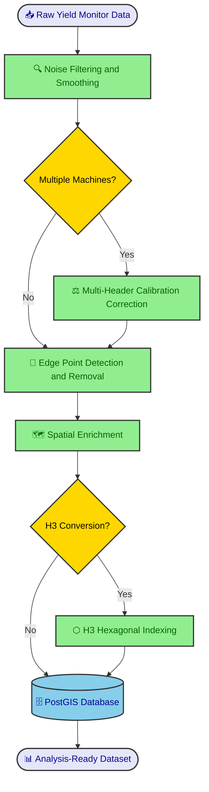

!!! abstract "Case Study Summary"
    **Industry**: Precision Agriculture / Agricultural Technology  
    
    **Impact Metrics**:
    
    - 85% reduction in manual yield data processing time per campaign
    - 130,000+ hectares processed per season across multiple farms
    - 40–60% noise reduction in raw yield monitor datasets
    - Consistent, analysis-ready spatial datasets enabling cross-campaign comparison for the first time
    - Full integration with ERP, crop monitoring platforms, and management zone layers

## Overview

Raw yield monitor data is one of the most valuable agronomic assets in a large-scale farming operation — but only when it is properly processed. This case study describes the design and implementation of an end-to-end workflow that transforms noisy, unreliable yield monitor exports into a clean, enriched, and spatially consistent analytics layer ready for agronomic decision support.

## The Challenge

Yield monitors generate massive volumes of georeferenced data during harvest. However, the raw output is plagued by systematic noise: overlap between harvester passes, partially filled headers at field edges, sensor time lag at the beginning of each swath, abrupt speed changes, and calibration drift across different machines or headers operating in the same field.

Without proper cleaning, yield maps display spatial artifacts that can be mistaken for real agronomic variability. This distorts any downstream analysis — from trial interpretation and environment evaluation to variable rate prescriptions and profitability mapping.

The operation faced several specific constraints:

- **Multiple machines per field**: Different combines and headers introduced systematic bias that could not be corrected with simple filtering.
- **No standardized processing**: Each agronomist handled data differently, producing inconsistent results across farms and seasons.
- **Large geographic scale**: With tens of thousands of hectares, a manual or semi-manual approach was not sustainable.
- **Integration needs**: Cleaned yield data needed to connect seamlessly with management zones, land capability layers, risk assessments, ERP records, and external crop monitoring platforms.

## Technical Approach

### Technology Stack

- **Language**: Python
- **Geospatial Processing**: GeoPandas, Shapely, Fiona, GDAL/OGR, Wbw-Pro
- **Spatial Indexing**: H3 (Uber's hexagonal hierarchical spatial index)
- **Database**: PostgreSQL with PostGIS
- **Visualization**: QGIS for validation and map production
- **Integration**: Custom connectors to ERP systems and crop monitoring platforms (SIMA)
- **Orchestration**: Modular Python pipeline with configurable parameters per field and campaign

### Architecture

!!! info "System Architecture"
    The pipeline is fully modular: each processing step can be configured, skipped, or parameterized independently depending on the characteristics of the field and the harvesting operation. This design allows the same workflow to handle single-machine fields and complex multi-combine scenarios without code changes.
    
    **Core Components**:

    - **Noise Filter Module**: Applies statistical and spatial filtering to remove common harvesting artifacts
    - **Calibration Correction Engine**: Detects and normalizes systematic differences between harvesting regions
    - **Edge Detector**: Identifies and flags points affected by partial header width near boundaries
    - **Spatial Enrichment Layer**: Joins cleaned data with management zones, land capability, risk layers, and business data
    - **H3 Indexer**: Converts point-based datasets into compact hexagonal grids for scalable analytics

## Implementation Highlights

### Step 1 — Noise Filtering and Smoothing

Raw yield points are filtered using a combination of statistical thresholds and spatial consistency checks. This step removes the most common artifacts: extreme outlier values, zero-yield readings, points recorded during speed changes, and time-lag distortions at the start of each pass.

*Left: Raw yield monitor data showing significant noise and spatial inconsistency. Right: Cleaned and smoothed dataset with artifacts removed, revealing the true spatial yield pattern.*

### Step 2 — Multi-Header Calibration Correction

When a field has been harvested by more than one combine or header, each machine may record systematically different yield values due to calibration differences. The workflow detects harvesting regions, compares each region against its neighbors, and iteratively applies compensation values until the entire field is normalized to a consistent baseline.

A key component of this correction is the **yield index** (`rinde_ind`): for each lot, the monitor yield is expressed as a ratio relative to the lot mean, producing a dimensionless index that captures the spatial variability pattern independently of absolute values. This index is then multiplied by the **ERP yield** (`Rinde_Albalanza`) — the actual yield calculated from truck scale weights at delivery — which is the most reliable ground-truth measurement available. The result is the **corrected yield** (`rinde_corregido`): a spatially variable map that preserves the relative pattern from the monitor but is anchored to the real, scale-verified production of each lot.

*Correction table by lot, crop, genotype, treatment, and management zone. The yield index (`rinde_ind`) expresses each monitor value relative to the lot mean. The corrected yield (`rinde_corregido`) is obtained by multiplying this index by the ERP scale-based yield (`Rinde_Albalanza`), anchoring spatial variability to the most reliable production measurement.*

### Step 3 — Edge Point Detection and Cleanup

Points located near field boundaries are frequently distorted due to partial header width during harvesting. The workflow identifies these edge points using spatial proximity analysis against field boundary geometries and either removes or flags them to prevent their influence on downstream analytics.

*Edge point classification: green points are retained as valid interior data; red points are identified as boundary-affected and excluded from analysis.*

### Step 4 — Spatial Enrichment

The cleaned yield dataset is spatially joined with multiple contextual layers:

- **Management zones** derived from soil surveys, elevation models, and historical productivity
- **Land capability classifications** reflecting soil aptitude and drainage characteristics
- **Risk layers** for flood-prone or degraded areas
- **Field boundaries and lot identifiers** from the company's cadastral database
- **ERP data** including input costs, planting dates, and applied treatments
- **Crop monitoring data** from platforms like SIMA

This enrichment transforms the yield data from a standalone spatial layer into a multidimensional analytical dataset.

### Step 5 — H3 Hexagonal Grid Conversion (Optional)

When long-term storage and cross-campaign comparison are priorities, the final dataset is converted from raw point geometries into an H3-indexed hexagonal grid. This provides several advantages over traditional geometry-based operations:

*Left: Management zone boundaries derived from soil and topographic analysis. Right: Cleaned yield data aggregated into H3 hexagonal cells, overlaid with management zone delineations for spatial comparison.*

!!! note "Why H3?"
    H3 hexagonal grids provide uniform spatial resolution, efficient indexing, and seamless aggregation across campaigns. Unlike irregular point clouds, H3 cells enable direct comparison between seasons without complex spatial join operations, making large-scale historical analysis significantly faster and more consistent.

## Results & Impact

The implementation of this workflow delivered measurable improvements across the entire agronomic data lifecycle:

- **+85% reduction in processing time**: What previously required days of manual work per farm is now completed in hours through the automated pipeline.
- **40–60% noise reduction**: Statistical and spatial filtering consistently removes a significant portion of raw data artifacts, depending on harvest conditions and equipment.
- **30,000+ hectares processed per season**: The workflow scales across the company's full operational footprint without degradation in processing quality.
- **First-ever cross-campaign comparison capability**: With H3-indexed historical data, agronomists can now compare yield performance across multiple seasons at consistent spatial resolution.
- **Unified data standard**: All farms, lots, and campaigns produce datasets in the same format, enabling company-wide analytics and benchmarking.
- **Seamless integration**: Enriched datasets connect directly to management zone analysis, trial interpretation, variable rate prescriptions, and business intelligence dashboards.

## My Contributions

- **Designed the complete end-to-end workflow architecture**, defining the processing sequence and data flow from raw monitor exports to analysis-ready datasets.
- **Configured and parameterized each processing stage**, including noise filtering thresholds, multi-header calibration logic, edge detection distances, and spatial enrichment joins.
- **Developed the spatial enrichment pipeline**, integrating cleaned yield data with management zones, land capability layers, risk assessments, ERP records, and crop monitoring platforms.
- **Implemented the H3 conversion module**, enabling compact storage and scalable cross-campaign analytics on the company's PostgreSQL/PostGIS infrastructure.
- **Established quality assurance protocols**, including visual validation in QGIS and statistical consistency checks to ensure processing integrity across different field conditions.
- **Trained agronomic staff** on interpreting cleaned yield data and using the enriched datasets for trial analysis, environment evaluation, and prescription generation.

-   :material-coffee:{ .lg .middle } Let's grab a virtual coffee together!

    ---

    Do you need to build a reliable spatial data pipeline for your agricultural operation? Book a free 30-minute session to discuss your yield data challenges and explore how we can work together.

    [Book a free call :material-arrow-top-right:](https://calendly.com){ .md-button .md-button--primary }

