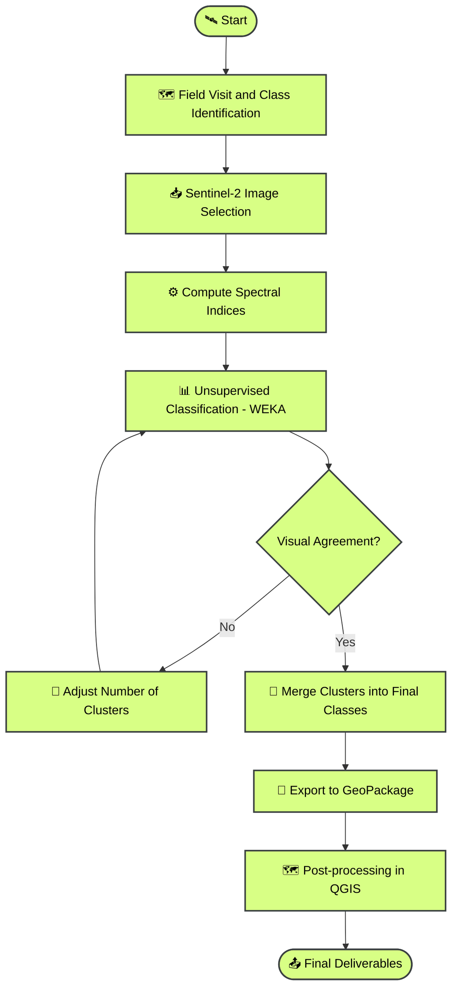

# Semi-Automatic Land Cover Classification with Sentinel-2

!!! abstract "Case Study Summary"
    **Industry**: Cattle Ranching & Agricultural Land Evaluation  
    **Location**: San Luis Province, Argentina  
    
    **Impact Metrics**:
    
    - **+12,700 hectares** classified into 10 distinct land-cover classes in under one week
    - **75% time reduction** compared to manual mapping (estimated 4+ weeks reduced to < 1 week)
    - **10 land-cover classes** successfully discriminated using medium-resolution satellite imagery
    - Repeatable workflow adaptable to other fields and future evaluations

---

## Overview

A large cattle ranch in San Luis, Argentina — spanning over 12,700 hectares — needed a comprehensive land-cover and soil characterization map to evaluate its potential for agricultural conversion. Given the field's vast extent and the high number of visually similar environmental classes, manual mapping was virtually impracticable. A semi-automatic classification approach using Sentinel-2 imagery and unsupervised machine learning was designed and executed to deliver accurate, spatially explicit results.

---

## The Challenge

The field presented a complex mosaic of natural grasslands, woodlands, dunes, and pastures — **10 distinct environmental classes** in total — many of which shared similar spectral signatures. The core challenges were:

- **Scale**: Over 12,700 hectares made manual delineation unfeasible within any reasonable timeframe.
- **Class similarity**: Several grassland and woodland categories (e.g., very open vs. open woodland, sandy vs. semi-sandy grassland) were extremely difficult to separate visually, even with satellite imagery.
- **Lack of high-resolution imagery**: No commercial high-resolution imagery was available for the area at the time of analysis, ruling out a straightforward supervised classification with fine-grained training samples.
- **Decision-critical output**: The classification results would directly inform land-use planning decisions — accuracy was non-negotiable.

---

## Technical Approach

### Technology Stack

| Component         | Technology                                    |
|-------------------|-----------------------------------------------|
| **Remote Sensing** | Sentinel-2 MSI (10–20 m resolution)          |
| **Processing**     | Google Earth Engine (GEE)                     |
| **Classification** | WEKA (unsupervised clustering via GEE)        |
| **Spectral Indices** | NDVI, GNDVI, MNDWI, EVI, GCI, BSI          |
| **Post-processing** | QGIS                                        |
| **Output Formats** | GeoPackage (GPKG), Excel, PDF maps           |

### Spectral Indices Used

Each index was selected to maximize discrimination between the 10 target classes:

| Index   | Full Name                              | Purpose                                          |
|---------|----------------------------------------|--------------------------------------------------|
| **NDVI**  | Normalized Difference Vegetation Index | General vegetation vigor and density              |
| **GNDVI** | Green NDVI                             | Sensitivity to chlorophyll concentration          |
| **EVI**   | Enhanced Vegetation Index              | Improved response in high-biomass areas           |
| **GCI**   | Green Chlorophyll Index                | Leaf chlorophyll content estimation               |
| **MNDWI** | Modified Normalized Difference Water Index | Bare soil and moisture discrimination     |
| **BSI**   | Bare Soil Index                        | Exposed soil and sand detection (dunes, degraded areas) |

### Classification Methodology

The key methodological decision was to use a **semi-supervised approach** — unsupervised clustering followed by expert-guided class merging — instead of a fully supervised classification. This was driven by two factors: the absence of high-resolution reference imagery, and the high number of spectrally similar classes that would have required an impractical volume of ground-truth samples.

The iterative process started with approximately **25 clusters** and was progressively refined — reducing and merging classes — until the output showed strong visual agreement with both the satellite imagery and the field observations collected during the site visit.

---

## Implementation Highlights

### Iterative Cluster Refinement

The unsupervised classification was not a single-pass operation. Multiple iterations were required, adjusting the number of initial clusters to find the optimal balance between over-segmentation (too many meaningless classes) and under-segmentation (losing important distinctions). The process followed this logic:

1. **High initial cluster count (~25)**: Deliberate over-segmentation to capture subtle spectral differences.
2. **Visual comparison**: Each iteration was compared against the Sentinel-2 composite and field notes.
3. **Progressive merging**: Clusters that corresponded to the same real-world class were merged, informed by field knowledge.
4. **Final output**: 10 clearly defined environmental classes with strong spatial coherence.

### Multi-Index Stacking Strategy

Rather than classifying on raw spectral bands alone, the classification input was a **multi-index stack** combining six spectral indices. This approach significantly improved class separability — particularly for the challenging grassland-woodland gradient — by leveraging each index's sensitivity to different biophysical properties (vegetation structure, chlorophyll content, soil exposure, and moisture).

### Final Land-Cover Classes and Areas

| Class                       | Area (ha) |
|-----------------------------|-----------|
| Sandy Natural Grassland     | 2,642     |
| Semi-Sandy Natural Grassland | 2,016   |
| Higher-Quality Natural Grassland | 1,771 |
| Lower-Quality Natural Grassland | 1,607 |
| Grassy Dune                 | 1,605     |
| Very Open Woodland          | 896       |
| Open Woodland               | 796       |
| Pasture                     | 716       |
| Dense Woodland              | 487       |
| Active Dune                 | 220       |
| **Total**                   | **12,756** |

!!! info "Classification Map"
    The final classification map and the Sentinel-2 composite used as reference are included as figures in this case study. The color-coded map shows the spatial distribution of all 10 classes across the entire field, with area statistics per class.

---

## Results & Impact

- **12,756 hectares** fully classified into 10 distinct land-cover classes with high spatial accuracy.
- **75% time reduction**: A task estimated at over 4 weeks of manual work was completed in less than 1 week — and with superior consistency across the entire field.
- **10 spectrally similar classes** successfully discriminated using only medium-resolution (10–20 m) Sentinel-2 data, without requiring any commercial high-resolution imagery.
- **Actionable deliverables**: GeoPackage files for GIS integration, Excel spreadsheets with per-class area statistics, and PDF maps ready for field use and management meetings.
- **Repeatable methodology**: The workflow is fully reproducible and can be adapted to other fields, other time periods, or converted into an automated Python pipeline for systematic monitoring.

---

## My Contributions

This was a **solo project**, end-to-end. My specific contributions included:

- **Field reconnaissance**: Personally conducted the field visit to identify, characterize, and geolocate the 10 land-cover classes.
- **Methodology design**: Designed the semi-supervised classification approach from scratch — choosing unsupervised clustering over supervised classification due to the lack of high-resolution imagery, and defining the iterative refinement strategy.
- **Spectral index selection**: Selected and computed the 6 spectral indices (NDVI, GNDVI, EVI, GCI, MNDWI, BSI) to maximize class separability based on the specific environmental conditions of the site.
- **Classification and iteration**: Executed the full classification pipeline in Google Earth Engine, iterating from ~25 initial clusters down to the final 10 classes through multiple rounds of visual validation and merging.
- **Post-processing and cartography**: Performed all post-processing in QGIS, including class labeling, area computation, and production of the final maps and deliverables.
- **Delivery**: Produced and delivered the complete set of outputs — GeoPackage, Excel, and PDF maps.

---

## Lessons Learned

!!! note "Methodological Insight"
    When high-resolution imagery is unavailable, a semi-supervised approach — unsupervised clustering followed by expert-guided merging — can outperform a poorly constrained supervised classification. The key enabler is strong field knowledge: without the field visit, the merging step would have been guesswork.

- **Multi-index stacking is essential** for complex class discrimination. Relying on raw bands alone would not have separated the grassland and woodland subtypes at Sentinel-2 resolution.
- **Iterative refinement beats one-shot classification**. Starting with more clusters than needed and merging down is a safer strategy than trying to hit the exact class count on the first attempt.
- **If I were to repeat this project today**, I would explore **Earth Embeddings** (foundation model-derived feature representations) to generate the classification classes — potentially achieving even better separability without manual index engineering.
- The workflow is a strong candidate for **automation in Python**, making it repeatable across multiple fields and time periods for systematic land-use monitoring.

-   :material-coffee:{ .lg .middle } Let's grab a virtual coffee together!

    ---

    Do you need to map and classify land cover over large areas using satellite imagery? Book a free 30-minute session to discuss your challenges and explore how we can work together.

    [Book a free call :material-arrow-top-right:](https://calendly.com){ .md-button .md-button--primary }

