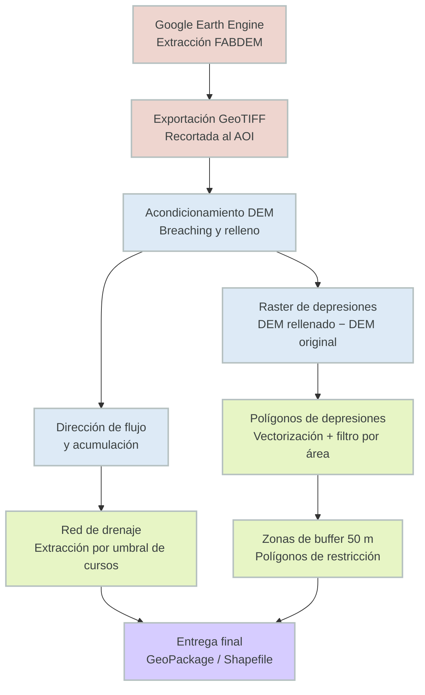

!!! abstract "Resumen del Caso de Estudio"
    **Industria**: Tecnología Agropecuaria / Agricultura de Precisión

    **Métricas de Impacto**:

    - Más de 130.000 hectáreas analizadas en múltiples establecimientos en una sola ejecución
    - 100% de identificación automatizada de áreas cóncavas sin drenaje — sin digitalización manual
    - Zonas de restricción con buffer de 50 m generadas automáticamente alrededor de cada área identificada
    - Pipeline reutilizable para evaluación de riesgo de heladas y ubicación de silobolsas de forma simultánea

---

## Descripción General

Este proyecto entrega un pipeline geoespacial automatizado para identificar depresiones topográficas —áreas donde el agua se acumularía bajo precipitaciones continuas— y mapear las vías de drenaje que las conectan a lo largo de campos agrícolas. Los resultados apoyan directamente decisiones de manejo agropecuario de precisión: determinar zonas seguras para la colocación de silobolsas e identificar áreas con mayor riesgo de heladas.

---

## El Problema

La ubicación inadecuada de silobolsas en campos agrícolas de Argentina representa un riesgo operativo persistente. Las áreas cóncavas sin drenaje natural pueden acumular agua tras lluvias intensas, provocando daños por humedad en el grano y pérdidas económicas significativas. Identificar estas zonas de forma tradicional requería relevamientos en campo por parte de agrónomos —costosos y lentos a escala— o interpretación manual de datos de elevación sin una metodología estandarizada.

Más allá de la ubicación de silobolsas, los mismos patrones topográficos que generan riesgo de anegamiento están correlacionados con la acumulación de aire frío y mayor riesgo de heladas, un caso de uso secundario que las herramientas de gestión agrícola existentes raramente abordan de forma automatizada a escala de lote.

Restricciones clave que la solución debía resolver:

- **Escala**: El análisis debía ser reproducible en múltiples campos sin retrabajo manual por parcela.
- **Calidad del dato**: Los modelos de elevación estándar (SRTM, ASTER) contienen ruido significativo por vegetación y construcciones en paisajes agrícolas; se requería un modelo de tierra desnuda.
- **Practicidad del output**: Los resultados debían incluir una zona de buffer conservadora para traducir el análisis topográfico en polígonos de restricción accionables.

---

## Enfoque Técnico

### Stack Tecnológico

- **Datos de Elevación**: [FABDEM](https://gee-community-catalog.org/projects/fabdem/) (Forest And Buildings removed Copernicus DEM) — DEM global de tierra desnuda a ~30 m de resolución, libre de artefactos por vegetación y edificaciones
- **Extracción de Datos**: API Python de Google Earth Engine (`earthengine-api`)
- **Procesamiento Hidrológico**: WhiteboxTools Python frontend (`whitebox`)
- **I/O y Manipulación Geoespacial**: GeoPandas, Fiona, Rasterio, Shapely
- **Operaciones de Buffer y Vectores**: GeoPandas con CRS proyectado
- **Entorno**: Python 3.11+, reproducible vía `requirements.txt`

### ¿Por qué FABDEM?

La mayoría de los DEMs gratuitos (SRTM, Copernicus DEM) conservan artefactos de elevación por copa de árboles y techos de edificaciones. En zonas agrícolas, esto genera depresiones falsas y distorsiona los modelos de acumulación de flujo. FABDEM aplica remoción de canopeo y construcciones basada en machine learning sobre el Copernicus DEM GLO-30, produciendo una superficie de tierra desnuda significativamente más limpia —crítica para un análisis hidrológico preciso a escala de lote.

!!! info "Arquitectura del Sistema"
    El pipeline sigue una estructura ETL lineal: extracción en la nube → procesamiento hidrológico local → output vectorial con zonas de buffer.

    **Componentes**:

    - **Módulo de Extracción GEE**: Obtiene y recorta tiles de FABDEM para el área de interés; exporta como GeoTIFF a Google Drive
    - **Módulo de Procesamiento WhiteboxTools**: Ejecuta acondicionamiento del DEM, análisis de relleno/breach de depresiones, dirección de flujo, acumulación de flujo y extracción de red de drenaje
    - **Módulo de Mapeo de Depresiones**: Calcula el raster diferencia DEM rellenado − DEM original para aislar áreas cóncavas; vectoriza y filtra por umbral de área mínima
    - **Módulo de Vías de Drenaje**: Extrae la red de acumulación de flujo sobre un umbral configurable; convierte a vector de polilíneas
    - **Módulo de Buffer y Zonas de Restricción**: Aplica buffer planimétrico de 50 m a los polígonos de depresión; disuelve zonas superpuestas; genera la capa de restricción final

### Diagrama de Procesamiento

---

## Detalles de Implementación

### 1. Extracción de FABDEM mediante la API Python de GEE

El área de interés se pasa como geometría GeoJSON. El script recorta la colección de imágenes FABDEM, reproyecta a un CRS métrico y exporta el resultado como GeoTIFF optimizado para la nube.

*Modelo digital de elevación hidrológico (DEM) para el área de estudio.*

### 2. Identificación de Depresiones con WhiteboxTools

Las depresiones se extraen calculando la diferencia entre el DEM hidrológicamente rellenado y el original. Las celdas con diferencia positiva indican sumideros topográficos —áreas donde el agua se acumularía.

### 3. Extracción de la Red de Drenaje

La dirección y acumulación de flujo se calculan con el algoritmo D8. Un umbral de área de captación configurable determina el tamaño mínimo de cuenca necesario para que una celda sea clasificada como canal de drenaje.

*Imagen satelital correspondiente como referencia visual junto al modelo de terreno.*

### 4. Generación de Zonas de Restricción

Se aplica un buffer planimétrico de 50 m a cada polígono de depresión para definir la zona de exclusión operativa para la colocación de silobolsas. Los buffers superpuestos se disuelven para evitar polígonos redundantes.

---

## Resultados e Impacto

| Métrica | Valor |
|---|---|
| Hectáreas analizadas | más de 130.000 ha en múltiples establecimientos |
| Resolución del DEM utilizado | 30 m (FABDEM tierra desnuda) |
| Equivalente automatizado previo | Ninguno — este análisis no se realizaba a esta escala |

- **Eliminación del error manual**: El enfoque hidrológico es completamente determinístico — toda depresión por encima del umbral mínimo de área es capturada, sin subjetividad del analista.
- **Reutilización**: El mismo pipeline puede re-ejecutarse para cualquier nueva geometría de campo sin modificar el código — solo cambia el input del área de interés.
- **Output de doble uso**: La capa de depresiones es directamente reutilizable para evaluación de riesgo de heladas, aportando valor agronómico adicional más allá del caso de uso original de silobolsas.
- **Gestión de riesgo conservadora**: El buffer de 50 m agrega un margen de seguridad más allá del borde de la depresión, contemplando las limitaciones de resolución del DEM y el espacio de maniobra de la maquinaria.

---

## Mis Contribuciones

- **Diseño e implementación end-to-end del pipeline** en Python, desde la extracción de datos en GEE hasta los outputs vectoriales finales
- **Selección del dato de elevación**: Evalué múltiples productos DEM globales y seleccioné FABDEM específicamente por su corrección de tierra desnuda, crítica para el análisis hidrológico en contextos agrícolas
- **Integración de WhiteboxTools**: Configuré y encadené el flujo hidrológico completo — análisis de breaching y relleno, dirección de flujo, acumulación de flujo, extracción de la red de drenaje y vectorización de depresiones
- **Parametrización del buffer**: Definí el buffer de exclusión de 50 m como umbral operativo conservador, con el parámetro expuesto para personalización por cliente
- **Identificación del caso de uso secundario**: Reconocí y documenté la aplicación de la capa de depresiones para riesgo de heladas como entregable adicional sin costo de procesamiento extra
- **Decisiones de formato de output**: Entregué los resultados en GeoPackage para compatibilidad con QGIS, ArcGIS y plataformas comunes de gestión agrícola

---

-   :material-sprout:{ .lg .middle } ¿Necesitás mapear el riesgo hídrico en tus campos?

    ---

    ¿Querés identificar zonas de anegamiento o riesgo de heladas a escala de lote antes de la próxima campaña? Reservá una sesión gratuita de 30 minutos para analizar tus datos y explorar cómo podemos trabajar juntos.

    [Reservar una llamada gratuita :material-arrow-top-right:](https://calendly.com){ .md-button .md-button--primary }

