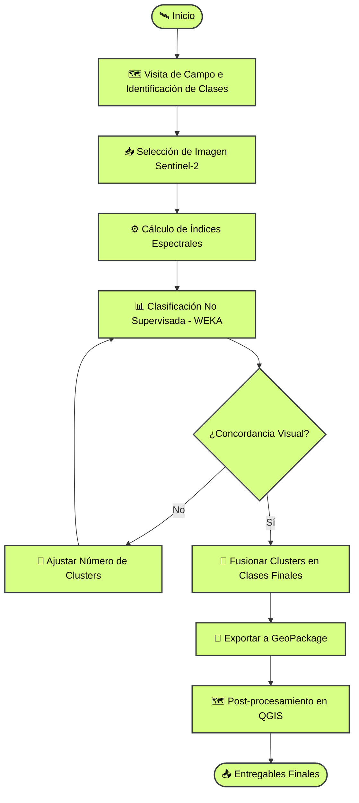

# Clasificación Semi-Automática de Cobertura del Suelo con Sentinel-2

!!! abstract "Resumen del Caso de Estudio"
    **Industria**: Agricultura y Ganadería
    **Ubicación**: Provincia de San Luis, Argentina  
    
    **Métricas de Impacto**:
    
    - **+12.700 hectáreas** clasificadas en 10 clases de cobertura del suelo en menos de una semana
    - **75% de reducción de tiempo** en comparación con el mapeo manual (estimado de 4+ semanas reducido a < 1 semana)
    - **10 clases de cobertura** discriminadas exitosamente usando imágenes satelitales de resolución media
    - Flujo de trabajo repetible y adaptable a otros campos y evaluaciones futuras

---

## Descripción General

Un gran campo ganadero en San Luis, Argentina — de más de 12.700 hectáreas — necesitaba un mapa integral de cobertura del suelo para evaluar su potencial de reconversión agrícola. Dada la vasta extensión del campo y la gran cantidad de clases de ambiente visualmente similares, el mapeo manual era virtualmente impracticable. Se diseñó y ejecutó un enfoque de clasificación semi-automática utilizando imágenes Sentinel-2 y aprendizaje automático no supervisado para obtener resultados precisos y espacialmente explícitos.

---

## El Desafío

El campo presentaba un mosaico complejo de pastizales naturales, montes, médanos y pasturas — **10 clases ambientales distintas** en total — muchas de las cuales compartían firmas espectrales similares. Los desafíos principales fueron:

- **Escala**: Más de 12.700 hectáreas hacían inviable la delimitación manual en un plazo razonable.
- **Similitud entre clases**: Varias categorías de pastizal y monte (ej., monte muy abierto vs. abierto, pastizal arenoso vs. semi-arenoso) eran extremadamente difíciles de separar visualmente, incluso con imágenes satelitales.
- **Falta de imágenes de alta resolución**: No se contaba con imágenes de alta resolución disponibles para la zona al momento del análisis, descartando una clasificación supervisada directa con muestras de entrenamiento de alta granularidad.
- **Resultados críticos para la toma de decisiones**: Los resultados de la clasificación informarían directamente las decisiones de planificación de uso del suelo — la precisión no era negociable.

---

## Enfoque Técnico

### Stack Tecnológico

| Componente          | Tecnología                                    |
|---------------------|-----------------------------------------------|
| **Teledetección**   | Sentinel-2 MSI (resolución 10–20 m)          |
| **Procesamiento**   | Google Earth Engine (GEE)                     |
| **Clasificación**   | WEKA (clustering no supervisado vía GEE)      |
| **Índices Espectrales** | NDVI, GNDVI, MNDWI, EVI, GCI, BSI        |
| **Post-procesamiento** | QGIS                                       |
| **Formatos de Salida** | GeoPackage (GPKG), Excel, mapas PDF        |

### Índices Espectrales Utilizados

Cada índice fue seleccionado para maximizar la discriminación entre las 10 clases objetivo:

| Índice  | Nombre Completo                                | Propósito                                            |
|---------|------------------------------------------------|------------------------------------------------------|
| **NDVI**  | Índice de Vegetación de Diferencia Normalizada | Vigor y densidad general de la vegetación            |
| **GNDVI** | NDVI Verde                                     | Sensibilidad a la concentración de clorofila         |
| **EVI**   | Índice de Vegetación Mejorado                  | Mejor respuesta en áreas de alta biomasa             |
| **GCI**   | Índice de Clorofila Verde                      | Estimación del contenido de clorofila foliar         |
| **MNDWI** | Índice de Agua de Diferencia Normalizada Modificado | Discriminación de suelo desnudo y humedad     |
| **BSI**   | Índice de Suelo Desnudo                        | Detección de suelo expuesto y arena (médanos, áreas degradadas) |

### Metodología de Clasificación

La decisión metodológica clave fue utilizar un **enfoque semi-supervisado** — clustering no supervisado seguido de fusión de clases guiada por expertos — en lugar de una clasificación completamente supervisada. Esto estuvo motivado por dos factores: la ausencia de imágenes de referencia de alta resolución, y la gran cantidad de clases espectralmente similares que habrían requerido un volumen impracticable de muestras de verdad de campo.

El proceso iterativo comenzó con aproximadamente **25 clusters** y fue refinado progresivamente — reduciendo y fusionando clases — hasta que la salida mostró una fuerte concordancia visual tanto con las imágenes satelitales como con las observaciones de campo recolectadas durante la visita al sitio.

---

## Aspectos Destacados de la Implementación

### Refinamiento Iterativo de Clusters

La clasificación no supervisada no fue una operación de un solo paso. Se requirieron múltiples iteraciones, ajustando el número de clusters iniciales para encontrar el balance óptimo entre sobre-segmentación (demasiadas clases sin significado) y sub-segmentación (perder distinciones importantes). El proceso siguió esta lógica:

1. **Alto número inicial de clusters (~25)**: Sobre-segmentación deliberada para capturar diferencias espectrales sutiles.
2. **Comparación visual**: Cada iteración se comparó contra el compuesto Sentinel-2 y las notas de campo.
3. **Fusión progresiva**: Los clusters que correspondían a la misma clase real fueron fusionados, informados por el conocimiento de campo.
4. **Salida final**: 10 clases ambientales claramente definidas con fuerte coherencia espacial.

### Estrategia de Apilamiento Multi-Índice

En lugar de clasificar solo con bandas espectrales crudas, la entrada de clasificación fue un **stack multi-índice** combinando seis índices espectrales. Este enfoque mejoró significativamente la separabilidad entre clases — particularmente para el desafiante gradiente pastizal-monte — al aprovechar la sensibilidad de cada índice a diferentes propiedades biofísicas (estructura de la vegetación, contenido de clorofila, exposición del suelo y humedad).

### Clases de Cobertura y Superficies Finales

| Clase                              | Superficie (ha) |
|------------------------------------|-----------------|
| Pastizal Natural Arenoso           | 2.642           |
| Pastizal Natural Semi-Arenoso      | 2.016           |
| Pastizal Natural de Mayor Calidad  | 1.771           |
| Pastizal Natural de Menor Calidad  | 1.607           |
| Médano con Cobertura Vegetal       | 1.605           |
| Monte Muy Abierto                  | 896             |
| Monte Abierto                      | 796             |
| Pastura                            | 716             |
| Monte Denso                        | 487             |
| Médano Activo                      | 220             |
| **Total**                          | **12.756**      |

!!! info "Mapa de Clasificación"
    El mapa de clasificación final y el compuesto Sentinel-2 utilizado como referencia se incluyen como figuras en este caso de estudio. El mapa codificado por colores muestra la distribución espacial de las 10 clases en todo el campo, con estadísticas de superficie por clase.

---

## Resultados e Impacto

- **12.756 hectáreas** completamente clasificadas en 10 clases de cobertura del suelo con alta precisión espacial.
- **75% de reducción de tiempo**: Una tarea estimada en más de 4 semanas de trabajo manual fue completada en menos de 1 semana — y con una consistencia superior en todo el campo.
- **10 clases espectralmente similares** discriminadas exitosamente usando solo datos Sentinel-2 de resolución media (10–20 m), sin requerir imágenes comerciales de alta resolución.
- **Entregables accionables**: Archivos GeoPackage para integración GIS, planillas Excel con estadísticas de superficie por clase, y mapas PDF listos para uso en campo y reuniones de gestión.
- **Metodología repetible**: El flujo de trabajo es completamente reproducible y puede adaptarse a otros campos, otros períodos temporales, o convertirse en un pipeline automatizado en Python para monitoreo sistemático.

---

## Mis Contribuciones

Este fue un **proyecto individual**, de punta a punta. Mis contribuciones específicas incluyeron:

- **Reconocimiento de campo**: Realicé personalmente la visita al campo para identificar, caracterizar y geolocalizar las 10 clases de cobertura.
- **Diseño metodológico**: Diseñé el enfoque de clasificación semi-supervisada desde cero — eligiendo clustering no supervisado sobre clasificación supervisada debido a la falta de imágenes de alta resolución, y definiendo la estrategia de refinamiento iterativo.
- **Selección de índices espectrales**: Seleccioné y calculé los 6 índices espectrales (NDVI, GNDVI, EVI, GCI, MNDWI, BSI) para maximizar la separabilidad de clases según las condiciones ambientales específicas del sitio.
- **Clasificación e iteración**: Ejecuté el pipeline completo de clasificación en Google Earth Engine, iterando desde ~25 clusters iniciales hasta las 10 clases finales a través de múltiples rondas de validación visual y fusión.
- **Post-procesamiento y cartografía**: Realicé todo el post-procesamiento en QGIS, incluyendo etiquetado de clases, cálculo de superficies y producción de los mapas y entregables finales.
- **Entrega**: Produje y entregué el set completo de productos — GeoPackage, Excel y mapas PDF.

---

## Lecciones Aprendidas

!!! note "Reflexión Metodológica"
    Cuando no se dispone de imágenes de alta resolución, un enfoque semi-supervisado — clustering no supervisado seguido de fusión guiada por expertos — puede superar a una clasificación supervisada mal acotada. El habilitador clave es un fuerte conocimiento de campo: sin la visita al terreno, el paso de fusión habría sido pura especulación.

- **El apilamiento multi-índice es esencial** para la discriminación de clases complejas. Depender solo de bandas crudas no habría separado los subtipos de pastizal y monte a la resolución de Sentinel-2.
- **El refinamiento iterativo supera a la clasificación de un solo intento**. Comenzar con más clusters de los necesarios y fusionar hacia abajo es una estrategia más segura que intentar acertar el número exacto de clases en el primer intento.
- **Si repitiera este proyecto hoy**, exploraría **Earth Embeddings** (representaciones de características derivadas de modelos fundacionales) para generar las clases de clasificación — logrando potencialmente una separabilidad aún mejor sin ingeniería manual de índices.
- El flujo de trabajo es un fuerte candidato para **automatización en Python**, haciéndolo repetible en múltiples campos y períodos temporales para monitoreo sistemático del uso del suelo.

-   :material-coffee:{ .lg .middle } ¡Tomemos un café virtual juntos!

    ---

    ¿Necesitás mapear y clasificar cobertura del suelo en grandes extensiones usando imágenes satelitales? Reservá una sesión gratuita de 30 minutos para conversar sobre tus desafíos y explorar cómo podemos trabajar juntos.

    [Reservar una llamada gratuita :material-arrow-top-right:](https://calendly.com){ .md-button .md-button--primary }

