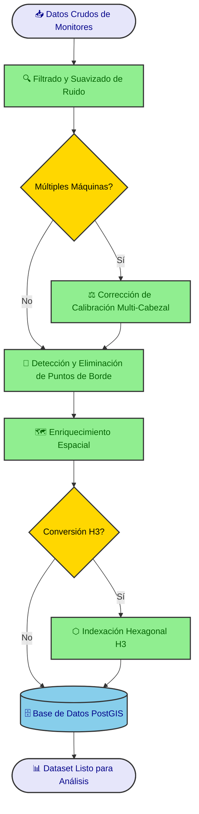

!!! abstract "Resumen del Caso de Estudio"
    **Industria**: Agricultura de Precisión / Tecnología Agrícola  
    
    **Métricas de Impacto**:
    
    - 85% de reducción en el tiempo de procesamiento manual de datos de rendimiento por campaña
    - 130.000+ hectáreas procesadas por temporada en múltiples establecimientos
    - 40–60% de reducción de ruido en datasets crudos de monitores de rendimiento
    - Datasets espaciales consistentes y listos para análisis, habilitando por primera vez la comparación entre campañas
    - Integración completa con ERP, plataformas de monitoreo de cultivos y capas de zonas de manejo

## Descripción General

Los datos crudos de monitores de rendimiento son uno de los activos agronómicos más valiosos en una operación agrícola de gran escala — pero solo cuando están correctamente procesados. Este caso de estudio describe el diseño e implementación de un flujo de trabajo de extremo a extremo que transforma las exportaciones ruidosas y poco confiables de monitores de rendimiento en una capa analítica limpia, enriquecida y espacialmente consistente, lista para el soporte de decisiones agronómicas.

## El Desafío

Los monitores de rendimiento generan volúmenes masivos de datos georreferenciados durante la cosecha. Sin embargo, la salida cruda está plagada de ruido sistemático: superposición entre pasadas de cosechadora, cabezales parcialmente llenos en los bordes del lote, retardo temporal del sensor al inicio de cada franja, cambios abruptos de velocidad y deriva de calibración entre diferentes máquinas o cabezales operando en el mismo lote.

Sin un procesamiento adecuado, los mapas de rendimiento muestran artefactos espaciales que pueden confundirse con variabilidad agronómica real. Esto distorsiona cualquier análisis posterior — desde la interpretación de ensayos y la evaluación de ambientes hasta las prescripciones de dosis variable y el mapeo de rentabilidad.

La operación enfrentaba varias restricciones específicas:

- **Múltiples máquinas por lote**: Diferentes cosechadoras y cabezales introducían sesgo sistemático que no podía corregirse con filtrado simple.
- **Sin procesamiento estandarizado**: Cada agrónomo manejaba los datos de forma diferente, produciendo resultados inconsistentes entre establecimientos y campañas.
- **Gran escala geográfica**: Con decenas de miles de hectáreas, un enfoque manual o semi-manual no era sostenible.
- **Necesidades de integración**: Los datos de rendimiento limpios debían conectarse sin problemas con zonas de manejo, capas de aptitud de suelo, evaluaciones de riesgo, registros del ERP y plataformas externas de monitoreo de cultivos.

## Enfoque Técnico

### Stack Tecnológico

- **Lenguaje**: Python
- **Procesamiento Geoespacial**: GeoPandas, Shapely, Fiona, GDAL/OGR, Wbw-Pro
- **Indexación Espacial**: H3 (índice espacial jerárquico hexagonal de Uber)
- **Base de Datos**: PostgreSQL con PostGIS
- **Visualización**: QGIS para validación y producción de mapas
- **Integración**: Conectores personalizados a sistemas ERP y plataformas de monitoreo de cultivos (SIMA)
- **Orquestación**: Pipeline modular en Python con parámetros configurables por lote y campaña

### Arquitectura

!!! info "Arquitectura del Sistema"
    El pipeline es completamente modular: cada paso de procesamiento puede configurarse, omitirse o parametrizarse de forma independiente según las características del lote y la operación de cosecha. Este diseño permite que el mismo flujo de trabajo maneje lotes con una sola máquina y escenarios complejos con múltiples cosechadoras sin cambios en el código.
    
    **Componentes Principales**:

    - **Módulo de Filtrado de Ruido**: Aplica filtrado estadístico y espacial para eliminar artefactos comunes de la cosecha
    - **Motor de Corrección de Calibración**: Detecta y normaliza diferencias sistemáticas entre regiones de cosecha
    - **Detector de Bordes**: Identifica y marca puntos afectados por ancho parcial del cabezal cerca de los límites
    - **Capa de Enriquecimiento Espacial**: Vincula datos limpios con zonas de manejo, aptitud de suelo, capas de riesgo y datos de negocio
    - **Indexador H3**: Convierte datasets basados en puntos en grillas hexagonales compactas para analítica escalable

## Aspectos Destacados de la Implementación

### Paso 1 — Filtrado y Suavizado de Ruido

Los puntos crudos de rendimiento se filtran usando una combinación de umbrales estadísticos y verificaciones de consistencia espacial. Este paso elimina los artefactos más comunes: valores atípicos extremos, lecturas de rendimiento cero, puntos registrados durante cambios de velocidad y distorsiones por retardo temporal al inicio de cada pasada.

*Izquierda: Datos crudos del monitor de rendimiento mostrando ruido significativo e inconsistencia espacial. Derecha: Dataset limpio y suavizado con artefactos eliminados, revelando el patrón espacial real de rendimiento.*

### Paso 2 — Corrección de Calibración Multi-Cabezal

Cuando un lote ha sido cosechado por más de una cosechadora o cabezal, cada máquina puede registrar valores de rendimiento sistemáticamente diferentes debido a diferencias de calibración. El flujo de trabajo detecta regiones de cosecha, compara cada región contra sus vecinas y aplica iterativamente valores de compensación hasta que todo el lote se normaliza a una línea base consistente.

Un componente clave de esta corrección es el **índice de rendimiento** (`rinde_ind`): para cada lote, el rendimiento del monitor se expresa como una relación respecto a la media del lote, produciendo un índice adimensional que captura el patrón de variabilidad espacial independientemente de los valores absolutos. Este índice se multiplica luego por el **rendimiento ERP** (`Rinde_Albalanza`) — el rendimiento real calculado a partir de los pesos de balanza de camión en la entrega — que es la medición de verdad terrestre más confiable disponible. El resultado es el **rendimiento corregido** (`rinde_corregido`): un mapa espacialmente variable que preserva el patrón relativo del monitor pero está anclado a la producción real, verificada por balanza, de cada lote.

*Tabla de corrección por lote, cultivo, genotipo, tratamiento y zona de manejo. El índice de rendimiento (`rinde_ind`) expresa cada valor del monitor relativo a la media del lote. El rendimiento corregido (`rinde_corregido`) se obtiene multiplicando este índice por el rendimiento de balanza ERP (`Rinde_Albalanza`), anclando la variabilidad espacial a la medición de producción más confiable.*

### Paso 3 — Detección y Limpieza de Puntos de Borde

Los puntos ubicados cerca de los límites del lote están frecuentemente distorsionados debido al ancho parcial del cabezal durante la cosecha. El flujo de trabajo identifica estos puntos de borde usando análisis de proximidad espacial contra las geometrías de límite del lote y los elimina o marca para prevenir su influencia en los análisis posteriores.

*Clasificación de puntos de borde: los puntos verdes se retienen como datos interiores válidos; los puntos rojos se identifican como afectados por el borde y se excluyen del análisis.*

### Paso 4 — Enriquecimiento Espacial

El dataset de rendimiento limpio se vincula espacialmente con múltiples capas contextuales:

- **Zonas de manejo** derivadas de relevamientos de suelo, modelos de elevación y productividad histórica
- **Clasificaciones de aptitud de suelo** que reflejan aptitud edáfica y características de drenaje
- **Capas de riesgo** para áreas inundables o degradadas
- **Límites de lote e identificadores catastrales** de la base de datos catastral de la empresa
- **Datos ERP** incluyendo costos de insumos, fechas de siembra y tratamientos aplicados
- **Datos de monitoreo de cultivos** de plataformas como SIMA

Este enriquecimiento transforma los datos de rendimiento de una capa espacial aislada en un dataset analítico multidimensional.

### Paso 5 — Conversión a Grilla Hexagonal H3 (Opcional)

Cuando el almacenamiento a largo plazo y la comparación entre campañas son prioridades, el dataset final se convierte de geometrías de puntos crudas a una grilla hexagonal indexada con H3. Esto proporciona varias ventajas sobre las operaciones tradicionales basadas en geometrías:

*Izquierda: Límites de zonas de manejo derivados de análisis de suelo y topografía. Derecha: Datos de rendimiento limpios agregados en celdas hexagonales H3, superpuestos con las delineaciones de zonas de manejo para comparación espacial.*

!!! note "¿Por qué H3?"
    Las grillas hexagonales H3 proporcionan resolución espacial uniforme, indexación eficiente y agregación fluida entre campañas. A diferencia de las nubes de puntos irregulares, las celdas H3 permiten la comparación directa entre temporadas sin operaciones complejas de vinculación espacial, haciendo que el análisis histórico a gran escala sea significativamente más rápido y consistente.

## Resultados e Impacto

La implementación de este flujo de trabajo entregó mejoras medibles a lo largo de todo el ciclo de vida de los datos agronómicos:

- **85% de reducción en el tiempo de procesamiento**: Lo que antes requería días de trabajo manual por establecimiento ahora se completa en horas a través del pipeline automatizado.
- **40–60% de reducción de ruido**: El filtrado estadístico y espacial elimina consistentemente una porción significativa de los artefactos de datos crudos, dependiendo de las condiciones de cosecha y el equipamiento.
- **30.000+ hectáreas procesadas por temporada**: El flujo de trabajo escala a toda la superficie operativa de la empresa sin degradación en la calidad del procesamiento.
- **Primera capacidad de comparación entre campañas**: Con datos históricos indexados con H3, los agrónomos pueden ahora comparar el rendimiento entre múltiples temporadas a resolución espacial consistente.
- **Estándar de datos unificado**: Todos los establecimientos, lotes y campañas producen datasets en el mismo formato, habilitando analítica y benchmarking a nivel de toda la empresa.
- **Integración fluida**: Los datasets enriquecidos se conectan directamente con análisis de zonas de manejo, interpretación de ensayos, prescripciones de dosis variable y dashboards de inteligencia de negocio.

## Mis Contribuciones

- **Diseñé la arquitectura completa del flujo de trabajo de extremo a extremo**, definiendo la secuencia de procesamiento, los límites de cada módulo y el flujo de datos desde las exportaciones crudas del monitor hasta los datasets listos para análisis.
- **Configuré y parametricé cada etapa de procesamiento**, incluyendo umbrales de filtrado de ruido, lógica de calibración multi-cabezal, distancias de detección de bordes y vinculaciones de enriquecimiento espacial.
- **Desarrollé el pipeline de enriquecimiento espacial**, integrando datos de rendimiento limpios con zonas de manejo, capas de aptitud de suelo, evaluaciones de riesgo, registros ERP y plataformas de monitoreo de cultivos.
- **Implementé el módulo de conversión H3**, habilitando almacenamiento compacto y analítica escalable entre campañas sobre la infraestructura PostgreSQL/PostGIS de la empresa.
- **Establecí protocolos de aseguramiento de calidad**, incluyendo validación visual en QGIS y verificaciones de consistencia estadística para asegurar la integridad del procesamiento bajo diferentes condiciones de campo.
- **Capacité al personal agronómico** en la interpretación de datos de rendimiento limpios y el uso de los datasets enriquecidos para análisis de ensayos, evaluación de ambientes y generación de prescripciones.

## Lecciones Aprendidas

- **La corrección de calibración es crítica**: Incluso pequeñas diferencias sistemáticas entre máquinas pueden producir patrones de rendimiento engañosos que distorsionan las conclusiones agronómicas. La normalización automatizada entre máquinas resultó esencial para lotes cosechados con múltiples cosechadoras.
- **Los efectos de borde se subestiman**: Los puntos afectados por el borde pueden representar el 10–15% del dataset de un lote. No eliminarlos introduce sesgo consistente en las estadísticas a nivel de zona.
- **H3 rinde frutos a escala**: Para análisis de una sola campaña, las geometrías tradicionales funcionan bien. Pero cuando la operación necesita comparar 3+ campañas en miles de hectáreas, la indexación hexagonal reduce dramáticamente la complejidad de las consultas y el tiempo de procesamiento.
- **La modularidad del flujo de trabajo facilita la adopción**: Diferentes establecimientos y agrónomos tienen diferentes necesidades. Hacer que cada paso de procesamiento sea opcional y configurable incrementó la adopción y la confianza en los resultados del pipeline.

-   :material-coffee:{ .lg .middle } ¡Tomemos un café virtual juntos!

    ---

    ¿Necesitás construir un pipeline de datos espaciales confiable para tu operación agrícola? Reservá una sesión gratuita de 30 minutos para conversar sobre tus desafíos con datos de rendimiento y explorar cómo podemos trabajar juntos.

    [Reservar una llamada gratuita :material-arrow-top-right:](https://calendly.com){ .md-button .md-button--primary }

